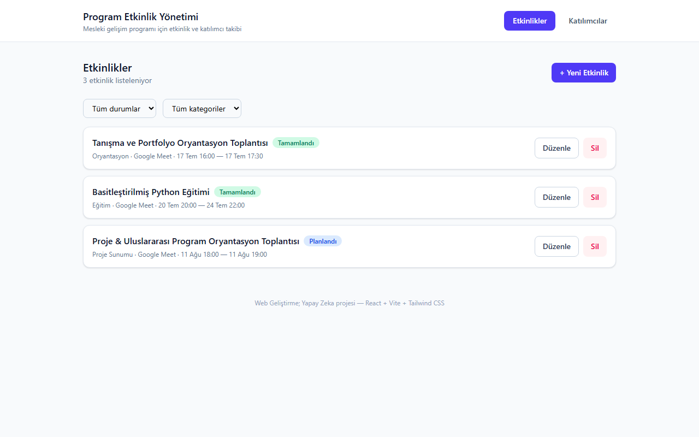

# Program Etkinlik Yönetimi

Mesleki gelişim programları için etkinlik ve katılımcı takip uygulaması. Bu proje **Social Office / TNC Group Yapay Zeka Mesleki Gelişim Programı**'nın "Web Geliştirme; Yapay Zeka" eğitimi kapsamında hazırlanmıştır.

🔗 **Canlı demo:** https://unrivaled-alfajores-49cad6.netlify.app



## Fikir

Programın kendisini (tanışma toplantıları, eğitim oturumları, proje sunumları) modelleyen küçük bir etkinlik yönetim sistemi: her etkinliğe kimlerin kayıtlı olduğunu, kimin katıldığını/katılmadığını takip eden ilişkisel bir mini CRM.

## Özellikler

- **Etkinlik yönetimi**: Ekle / Listele / Güncelle / Sil (CRUD)
  - Kategori (Eğitim, Proje Sunumu, Oryantasyon, Mülakat, Sosyal Etkinlik) ve durum (Planlandı / Tamamlandı / İptal) filtreleri
- **Katılımcı yönetimi**: Ekle / Listele / Güncelle / Sil (CRUD)
- **Etkinlik-katılımcı ilişkisi**: Bir etkinliğe katılımcı ekleme/çıkarma, katılım durumunu (Kayıtlı / Katıldı / Gelmedi / İptal) güncelleme
- Etkinlik detay sayfasında kapasite, katılım ve devamsızlık özet kartları

## Stack

- **React 18** + **Vite**
- **React Router** (sayfa yönlendirme)
- **Tailwind CSS** (stil)
- **localStorage** (veri kalıcılığı — backend gerektirmez)

## Klasör Yapısı

```
src/
  components/    # Yeniden kullanılabilir UI parçaları (Layout, Modal, Button, formlar)
  pages/         # Rota bazlı sayfalar (Events, EventDetail, Attendees)
  services/      # localStorage CRUD servis katmanı
  interfaces/    # Veri modeli tipleri (JSDoc) ve sabitler
```

## Çalıştırma

```bash
npm install
npm run dev
```

`http://localhost:5173` adresinde açılır. İlk açılışta örnek veri (3 etkinlik, 3 katılımcı) otomatik yüklenir.

## Build

```bash
npm run build
```

## Veri Modeli

- **Event**: id, title, description, location, category, startDateTime, endDateTime, capacity, status
- **Attendee**: id, fullName, email, phone
- **Registration**: id, eventId, attendeeId, registrationDate, attendanceStatus

## Telif

Öğrenme amaçlı staj/portföy projesidir.